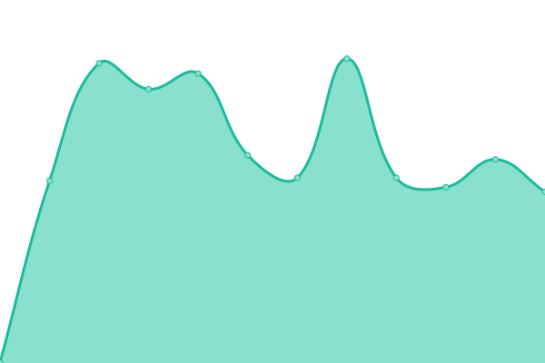

# [📈 Live Status](https://upptime.github.io/upptime): <!--live status--> **🟩 All systems operational**

<!--start: status pages-->
<!-- This summary is generated by Upptime (https://github.com/upptime/upptime) -->
<!-- Do not edit this manually, your changes will be overwritten -->
<!-- prettier-ignore -->
| URL | Status | History | Response Time | Uptime |
| --- | ------ | ------- | ------------- | ------ |
|  [INHFL GUI UAT](https://inhfl-uat.bgs.ac.uk/) | 🟩 Up | [inhfl-gui-uat.yml](https://github.com/Fuhji/upptime/commits/HEAD/history/inhfl-gui-uat.yml) | 

 7516ms
     
 | 

<a href="https://fuhji.github.io/upptime/history/inhfl-gui-uat">38.78%</a>
    

|  [INHFL GraphQL UAT](https://inhfl-api-uat.bgs.ac.uk/browser/graphql) | 🟩 Up | [inhfl-graph-ql-uat.yml](https://github.com/Fuhji/upptime/commits/HEAD/history/inhfl-graph-ql-uat.yml) | 

 884ms
     
 | 

<a href="https://fuhji.github.io/upptime/history/inhfl-graph-ql-uat">100.00%</a>
    

<!--end: status pages-->

[**Visit our status website →**](https://fuhji.github.io/upptime)

## 📄 License

- Powered by: [Upptime](https://github.com/upptime/upptime)
- Code: [MIT](./LICENSE) © [Anand Chowdhary](https://anandchowdhary.com), supported by [Pabio](https://pabio.com)
- Data in the `./history` directory: [Open Database License](https://opendatacommons.org/licenses/odbl/1-0/)
